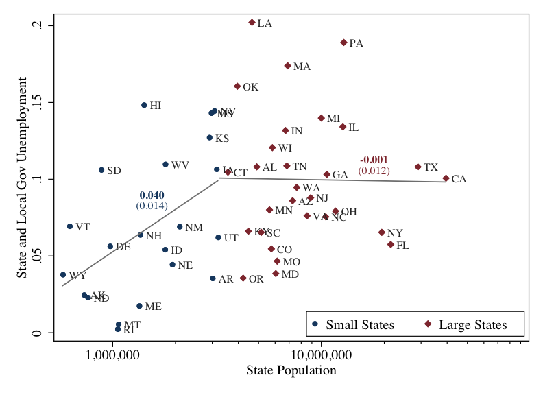

# State and Local Government Employment in the COVID-19 Crisis

This repository contains the replication files for Daniel Green and Erik Loualiche paper in the Journal of Public Economics.

+ *Green, Daniel and Erik Loualiche*: **State and Local Government Employment in the COVID-19 Crisis**;  Journal of Public Economics, 
+ [Download the paper](https://loualiche.gitlab.io/www/docs/munis_covid_GL.pdf)
+ [Publisher's website](https://doi.org/10.1016/j.jpubeco.2020.104321)
+ [Download the data](https://doi.org/10.7910/DVN/F9TYAI)





-------------------


## Downloading and reproducing the paper

+ **Method 1**: Download the data from the data repository
  + First download the dataset from the [data repository here](https://doi.org/10.7910/DVN/F9TYAI)
  + Unzip the data folder, and navigate to it.
    - You might have to edit the makefile to change the location of your binaries (stata) and/or install relevant packages in R

+ **Method 2**: directly from the repository (make sure your stata binary is in your path)
  ```bash
  git clone git@github.com:eloualiche/SL-Employment-Covid19.git
  cd SL-Employment-Covid19
  make download_data          # download the data from the dataverse 
  make                        # build the datasets and tables for the paper
  ```

-------------------


## Code


### Building the datasets

1. `assemble_1.R`: Read the flat files from the Census of Government and build a Census dataset. 
   + Input:  `./data/CoGIndFin/IndFinyy[abc].Txt`: special 60 files
             `./data/CoG/ASSGF/yyyyFinEstDAT*`: modern finance CoG public microuse files
             `./data/CoG/QTAX/**`: Quarterly Tax Files
             `CoG/census_state_codes.xlsx`, `fips_state.csv`
   + Output: `SandL_aggregates.fst`: aggregate Census expenditure categories
             `CensusFin_statelocalgov_taxes.fst`: filter only taxes revenue categories
             `QTAX_STATE_processed.dta`
2. `assemble_2.R`: Read the Local Area Unemployment Statistics
   + Input: `./data/LAU/ststdsadata.txt`, `LAU/ststdnsadata.txt`, `LAU/lau_all.txt`: ??
            `./data/LAU/sm.industry.txt`, `./data/LAU/sm.state.txt`, `./data/LAU/sm.supersector.txt`: ??
   + Output: `BLS_laborforce_size.dta`, `lau_aggregates.fst`
3. `assemble_3.R`: Read the ASPEP employment files
   + Input : `CoG/census_state_codes.xlsx`, `fips_state.csv`
             `CoG/ASPEP/yycempst` for Census years, `CoG/ASPEP/yyempst` for other years
   + Output: `ASPEP_local_payroll_aggregates_1993_2018.dta`
4. `assemble_4.do`: 
   + Input: `fips_state.csv`, `state_pop.dta`,  `state_daily_covid.csv`, 
            `CoG/ASSGF/2017_Combined.xlsx`, 
            `FFIS_COVID_19_State_by_State_Allocations.20.xlsx`, `NASBO/RainyDayFunds2011-2020.xlsx`
            `./data/CPS/cps_1980_2019.dta`, `./data/CPS/cps_post2020.dta`: from IPUMS
   + Output: `state_agg_cps_long_full.dta`, `state_occ_cps_long.dta`
             `muni_covid_combined_data_cps.dta`
5. `assemble_5.R`: 
   + Input: `./derived/state_agg_cps_long_full.dta`
            `./derived/lau_aggregates.fst`, `./derived/BLS_laborforce_size.dta`, 
            `./derived/ASPEP_local_payroll_aggregates_1993_2018.dta`
            `./derived/QTAX_STATE_processed.dta`,
            `./derived/CensusFin_localgov_taxes.fst`, `./derived/SandL_aggregates.fst`
   + Output: `reg_data_annual.dta`, 
             `./data/gdpdef.csv` (this file is in the repo; it can be downloaded using the Fred API)


### Generating Tables

1. `create_table_1.R`: 
   + Input: `./data/fips_state.csv`,  `./data/NASBO/RainyDayFunds*`
            `./derived/CensusFin_statelocalgov_taxes.fst`, `./derived/muni_covid_combined_data_cps.dta`
   + Output: [Table 1](./output/tables/summary_SL_covid.tex)
2. `create_figs_tables.do`
   + Input: `./derived/muni_covid_combined_data_cps.dta`
   + Output: [Figure 1](output/figures/cares_logpop_fs.pdf); [Figure 2](output/figures/cares_logpop_rf_no_controls.pdf)
             [Table 2](output/tables/muniLaidoffCovidDiff.tex); [Table 3](output/tables/cares_laidoff_IV.tex)
             [Table 4](output/tables/stateLaidOff_rainyday.tex)


Appendix Tables

0. `create_appendix_figs_tables.do`: 
   + Input: `derived/muni_covid_combined_data_cps.dta`, `derived/reg_data_annual.dta`
   + Output: [Table A4](output/appendix/tables/muniLaidoffCovidDiff_state_and_local.tex), [Table A5](output/appendix/tables/muniLaidoffRobustness.tex), [Table A6](output/appendix/tables/april_thru_august_combined.tex), [Table A7](output/appendix/tables/muniEmployPanel.tex)
             [Figure A1](output/appendix/figures/muni_laidofffrac_salestax_april2020-eps-converted-to.pdf); [Figure A2](output/appendix/figures/cares_formula.pdf)
1. `create_appendix_table_1.R`: Breakdown of State and Local Government Employment Declines
   + Input: `./derived/state_occ_cps_long.dta`
   + Output: [Table A1](./output/appendix/tables/summary_occupation.tex)
2. `create_appendix_table_2.R`: Tax revenus by population across states
   + Input: `data/fips_state.csv`, `data/state_pop.dta`, 
            `./derived/CensusFin_statelocalgov_taxes.fst`            
   + Output: [Table A2](./output/appendix/tables/summary_qtax3.tex)
3. `create_appendix_table_3.R`
   + Input: `./derived/state_agg_cps_long_full.dta`
   + Output: [Table A3](./output/appendix/tables/ts_cps_national2.tex)
4. `create_appendix_table_8.R`
   + Input: `./derived/BLS_laborforce_size.dta`, `./derived/lau_aggregates.fst`, 
            `./derived/SandL_aggregates.fst`
   + Output: [Table A8](./output/appendix/tables/table_ols_publicemp_full_horizon.tex)


-------------------


## Data Sources

+ **Census of Governments (CoG)**
  1. [Legacy *Special 60*](https://www.census.gov/programs-surveys/gov-finances/data/historical-data.html) files contain historical data from the CoG: `data/CoG/IndFin`
      Download them from the Census at: 
  2. [*Aspep*](https://www.census.gov/programs-surveys/apes.html): The Annual Survey of Public Employment and Payroll comes from the U.S. Census Bureau, reporting on state and local government civilian employment statistics.  
  3. [*ASSLGF*](https://www.census.gov/programs-surveys/state.html): Annual Survey of State and Local Government Finances 
  4. [*QTAX*](https://www.census.gov/programs-surveys/qtax.html): The Quarterly Summary of State and Local Tax Revenue is reported by the U.S. Census Bureau. 
+ **Census**: state population is from the Census and available here: 
  + For 2010-2019: `https://www2.census.gov/programs-surveys/popest/tables/2010-2019/state/totals/nst-est2019-01.xlsx`
  + For 2000-2010: `https://www2.census.gov/programs-surveys/popest/datasets/2010/2010-eval-estimates/nst-est2010-01.csv`
  + We only report our aggregated table `state_pop.dta`
+ [**Current Population Survey**](https://cps.ipums.org/cps/): we obtained the panel from the IPUMS Sample; see *Flood, King, Rodgers, Ruggles, and Warren (2020)*
+ **COVID-19 Data**: we download data from the [COVID tracking project](https://covidtracking.com).
  - Download the latest version with `wget --no-use-server-timestamps http://covidtracking.com/api/states/daily.csv -O  ./data/state_daily_covid.csv`  
  - Note that our version of the data was last updated on *Oct. 2nd 2020* and that the covid tracking has been revising some of the past data. This does not affect our estimates.
+ **State CRF Allocations**: we received the data from the [*Federal Funds Information for States*](https://ffis.org)


Data folder organization:
```bash
.
├── CPS
│   ├── cps_1980_2019.dta
│   └── cps_post2020.dta
├── CoG
│   ├── ASPEP
│   │   ├── 00empst.dat
│   │   ├── 01empst.dat
│   │   ├── 02cempst.dat
│   │   ├── 04empst.dat
│   │   ├── 05empst.dat
│   │   ├── 06empst.dat
│   │   ├── 07cempst.dat
│   │   ├── 08empst.dat
│   │   ├── 09empst.dat
│   │   ├── 10empst.dat
│   │   ├── 11empst.dat
│   │   ├── 12cempst.dat
│   │   ├── 13empst.dat
│   │   ├── 14empst.txt
│   │   ├── 15empst.txt
│   │   ├── 16empst.txt
│   │   ├── 17empst.txt
│   │   ├── 18empst.txt
│   │   ├── 92cempst.dat
│   │   ├── 93empst.dat
│   │   ├── 94empst.dat
│   │   ├── 95empst.dat
│   │   ├── 97cempst.dat
│   │   ├── 98empst.dat
│   │   └── 99empst.dat
│   ├── ASSLGF
│   │   ├── 2012FinEstDAT_10162019modp_pu.txt
│   │   ├── 2013FinEstDAT_10162019modp_pu.txt
│   │   ├── 2014FinEstDAT_10162019modp_pu.txt
│   │   ├── 2015FinEstDAT_10162019modp_pu.txt
│   │   ├── 2016FinEstDAT_10162019modp_pu.txt
│   │   ├── 2017FinEstDAT_02202020modp_pu.txt
│   │   └── 2017_Combined.xlsx
│   ├── IndFin
│   │   ├── IndFin**.Txt
│   ├── QTAX
│   │   ├── QTAX-categories.csv
│   │   ├── QTAX-data.csv
│   │   ├── QTAX-datatypes.csv
│   │   ├── QTAX-geolevels.csv
│   │   └── QTAX-timeperiods.csv
│   └── census_state_codes.xlsx
├── FFIS_COVID_19_State_by_State_Allocations.20.xlsx
├── LAU
│   ├── lau_all.txt
│   ├── lau_government.txt
│   ├── sm.area.txt
│   ├── sm.industry.txt
│   ├── sm.state.txt
│   ├── sm.supersector.txt
│   ├── ststdnsadata.txt
│   └── ststdsadata.txt
├── NASBO
│   ├── RainyDayFunds1986-1994.xlsx
│   ├── RainyDayFunds1995-2008.xlsx
│   ├── RainyDayFunds2009-2021.xlsx
│   └── RainyDayFunds2011-2020.xlsx
├── fips_state.csv
├── fred.api.txt
├── gdpdef.csv
├── state_daily_covid.csv
├── state_pop.dta
└── tables_to_brew
    ├── summary_SL_covid.brew.tex
    ├── summary_occupation.brew.tex
    ├── summary_qtax3.brew.tex
    ├── table_ols_publicemp_full_horizon.brew.tex
    └── ts_cps_national2.brew.tex
```


